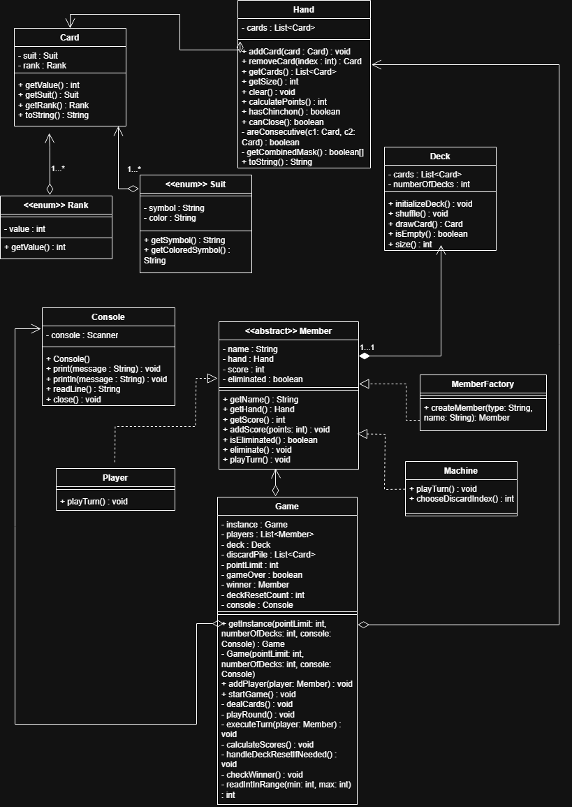
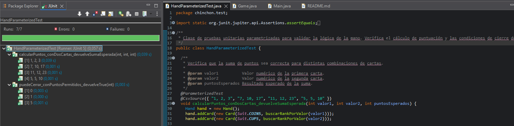

# Proyecto Chinchón - Java

Este proyecto consiste en la implementación del juego de cartas español Chinchón. Se ha desarrollado en Java siguiendo los principios de la programación orientada a objetos, utilizando 2 patrones de diseño (Singlenton y Factory en mi caso) para asegurar una estructura escalable y organizada.

## Descripción del Proyecto

El juego permite partidas entre un jugador humano y una inteligencia artificial (máquina) que toma decisiones de descarte automáticas. El motor del juego controla el flujo completo de la partida: desde el reparto de cartas y la gestión de turnos hasta el cálculo de puntuaciones y la eliminación de jugadores cuando superan el límite de puntos establecido.

Para el desarrollo se han aplicado los siguientes conceptos técnicos:

* **Patrón Singleton:** Implementado en la clase `Game` para garantizar que solo exista una instancia activa de la partida y centralizar el control del flujo.
* **Patrón Factory:** Utilizado en `MemberFactory` para instanciar de forma desacoplada tanto a jugadores humanos como a la IA.
* **Herencia y Polimorfismo:** Empleados en la jerarquía de `Member`, permitiendo que el juego gestione una lista genérica de jugadores independientemente de si son humanos o máquinas.
* **Encapsulamiento:** Toda la lógica de validación de combinaciones (tríos y escaleras) se encuentra protegida dentro de la clase `Hand`.

## UML (imagen y explicación)
El diseño arquitectónico del sistema, la modularización de los componentes del juego y sus relaciones se detallan en el siguiente diagrama de clases:

A continuación, se justifican técnicamente las relaciones y tipos de clases implementados según los requisitos del paradigma de la Programación Orientada a Objetos trabajados en el curso:

### 1. Clase Abstracta y Herencia (Polimorfismo)
* **Clase Abstracta `Member`:** Se ha definido como una clase abstracta porque representa un concepto genérico de "participante" en el juego del Chinchón. No tiene sentido instanciar un `Member` de forma directa, sino que sirve de plantilla base compartiendo atributos comunes como el nombre, la mano de cartas (`Hand`) y la puntuación acumulada.
* **Herencia (`Player` y `Machine`):** Las clases `Player` (usuario humano) y `Machine` (inteligencia artificial) heredan directamente de `Member`. Esta especialización permite aplicar **polimorfismo**: el motor del juego (`Game`) puede gestionar una lista genérica de participantes (`List<Member>`) y lanzar sus turnos de forma transparente, ejecutando la lógica de consola para el humano o los algoritmos de decisión automáticos para la máquina sin conocer su subtipo concreto.

### 2. Composición (Relación fuerte de ciclo de vida)
* **`Hand` en `Member`:** Existe una relación de **composición** de `Member` hacia `Hand`. Una mano de cartas no tiene sentido de la existencia si no pertenece a un jugador concreto. Si un jugador es eliminado o destruido en memoria, su mano se destruye con él. Su ciclo de vida está ligado al 100%.
* **`Card` en `Hand`:** La clase `Hand` compone las instancias de `Card` (las 7 cartas que maneja). La mano controla por completo la vida, inserción y descarte de estas estructuras inmutables.

### 3. Agregación (Relación débil / de pertenencia)
* **`Member` en `Game`:** El motor principal `Game` mantiene una relación de **agregación** hacia la lista de componentes `Member`. Aunque el juego coordina a los jugadores durante la partida, los jugadores tienen una identidad propia independiente del estado del tablero (de hecho, se crean fuera a través de la factoría y luego se añaden a la partida).
* **`Card` en `Deck`:** El mazo contiene y gestiona las cartas (`Card`), pero es una agregación puesto que las cartas pasan constantemente del mazo a las manos de los jugadores y a la pila de descartes, sobreviviendo de manera independiente a si el mazo se vacía o se reinicia.

## Pruebas del Sistema

Para asegurar el correcto funcionamiento de la lógica de juego, se han realizado diferentes tipos de pruebas unitarias utilizando JUnit:

### Pruebas de Caja Negra
Se han diseñado casos de prueba basados exclusivamente en las especificaciones de las reglas del Chinchón, sin tener en cuenta la implementación interna:
* **Validación de Combinaciones:** Verificación de que el sistema identifica correctamente tríos de diferentes palos y escaleras del mismo palo.
* **Reglas de Cierre:** Comprobación de que un jugador solo puede cerrar la ronda si cumple los requisitos de puntuación (tener 5 puntos o menos en cartas no combinadas).
* **Límite de Puntuación:** Verificación de que los jugadores son eliminados correctamente al alcanzar el límite de puntos de la partida.

### Pruebas de Caja Blanca
Se han realizado pruebas estructurales para garantizar que todos los caminos lógicos del código se ejecutan correctamente:
* **Caminos de Combinación:** Pruebas específicas para el método `getCombinedMask` para asegurar que las cartas se marcan como combinadas correctamente en situaciones complejas, como escaleras de gran longitud.
* **Lógica de Reabastecimiento:** Verificación del método de reinicio del mazo cuando se agotan las cartas y se debe recuperar la pila de descartes.
* **Control de Flujo:** Pruebas sobre los bucles de turno para confirmar que el juego gestiona correctamente los saltos de turno de jugadores eliminados.

### Evidencias de los Test Unitarios (JUnit 5)

Aquí está la captura de pantalla con la barra verde en Eclipse, demostrando que los 7 casos de prueba parametrizados con `@CsvSource` pasan correctamente:

#### ¿Qué se comprueba?

* **En el método `calcularPuntos_conDosCartas_devuelveSumaEsperada` (Caja Negra):** Probamos que la lógica del juego suma bien los puntos de las cartas sueltas que no se han podido combinar. Le metemos un par de cartas a la mano y comprobamos si el resultado coincide con lo que dicen las reglas (por ejemplo, que un 1 y un 2 sumen 3 puntos, o que un 11 y un 12 sumen 23). Es caja negra porque miramos que el resultado sea correcto según las normas, sin importar cómo esté programado el bucle por dentro.

* **En el método `puedeCerrar_conPuntosPermitidos_devuelveTrue` (Caja Blanca / Valores Límite):** Aquí atacamos directamente un camino crítico del código: la condición para poder cerrar la mano. Probamos los "valores frontera" permitidos por el reglamento, es decir, metemos de forma exacta 0, 1 y 5 puntos de penalización para asegurar que el `if (puntos <= 5)` interno funciona bien y devuelve `true` en todos los casos límite.

#### ¿Qué NO estamos comprobando aquí? (Límites del test)

* **No probamos combinaciones completas de 7 cartas:** Estos test son unitarios y simples; solo comprueban sumas de cartas sueltas y el límite de cierre, pero no simulan jugadas complejas (como tener un Chinchón con una escalera de 7 cartas seguidas del mismo palo).
* **No probamos el flujo general del juego:** Al probar solo la clase `Hand` aislada, no estamos testeando cómo roban las cartas del mazo (`Deck`), cómo se gestionan los turnos en `Game`, ni cómo decide la IA de la clase `Machine`. Eso ya formaría parte de las pruebas de integración del sistema completo.

### Requisitos Previos
* Java JDK 21 o superior.
* Un IDE compatible con Java (Eclipse, IntelliJ o VS Code).

### Instalación y Ejecución
1. Clonar el repositorio o descargar el código fuente.
2. Importar el proyecto en el IDE como un proyecto Java existente.
3. Localizar la clase `Main` dentro del paquete `chinchon.app`.
4. Ejecutar el método `main`.

### Cómo Jugar
1. **Inicio:** El juego configura los jugadores y reparte 7 cartas a cada uno de forma automática.
2. **Robo:** En tu turno, deberás elegir entre robar una carta del mazo o la última carta de la pila de descartes.
3. **Descarte:** Tras robar, deberás seleccionar qué carta descartar (índice 1-8) para volver a quedarte con 7 cartas.
4. **Cierre:** Si tus cartas no combinadas suman 5 puntos o menos, el sistema te permitirá cerrar la ronda. Si logras combinar las 7 cartas (Chinchón), ganas la partida directamente.
5. **Puntuación:** Al cerrar una ronda, se suman los puntos de las cartas sueltas. Aquel jugador que supere el límite de 100 puntos queda fuera de la partida.